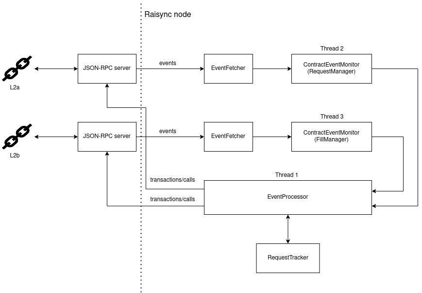

.. _development:

Development
===========

.. _development-overview:

Overview
--------

In this page, we will introduce following sections:

1. ``Getting Started`` part will explain requirements to develop the agent.

2. ``Agent Architecture and Implementation`` part will explain most used terms in agent and
how they are connected in the architecture.

3. ``Making a New Release`` part will explain how to create a new release.

4. ``The branching strategy`` part will explain how you should handle your branches.

.. _development-getting-started:

Getting Started
---------------

* The agent must not block in any way. That is, it must not happen that the agent is stuck endlessly
  waiting on any operation, regardless of reasons. Typical common issues here are a slow RPC server
  and a slow/unstable network.
* It must be possible to shut down the agent cleanly and reasonably quickly (at most few seconds).
* Restarting the agent must not lose any information about previously executed actions e.g. filled
  requests, claims, challenges etc.
* The agent should avoid serializing anything to non-volatile storage.

.. _development-agent:

Agent Architecture and Implementation
-------------------------------------

   Beamer agent architecture

In order to satisfy above requirements, we opted for a simple thread-based approach where we moved
all software components that could potentially block into their own threads. In particular, these
are ``EventMonitor`` and ``EventProcessor``.

For every transfer direction, we have an ``EventProcessor`` running on its own thread.

EventMonitor
~~~~~~~~~~~~

``EventMonitor`` listens for blockchain events emitted by given contracts, decodes the events
into an internal event representation (event types in ``beamer.events``) and forwards decoded events
to the ``EventProcessor``. The event monitor does not query the JSON-RPC server for events directly.
Rather, it does that via an instance of ``EventFetcher``. Event fetcher handles communication with the
JSON-RPC server and can block. However, even if the event fetcher for, say, source chain, blocks, since
it is only being invoked by the contract event monitor, which runs inside a thread, it won't block
the entire agent. Therefore, even if a JSON-RPC server is very slow or the connection is otherwise
unreliable, the agent as a whole will remain responsive.

With the current implementation, we have an event monitor for every L2 chain, and each event monitor
has its own event fetcher, as can be seen in the figure above. Each pair ``(EventFetcher, EventMonitor)``
works independently of the other, allowing for very different speeds between the L2 chains.

EventProcessor
~~~~~~~~~~~~~~

``EventProcessor`` implements the Beamer protocol logic. It receives events from event monitors and
stores them into a list. Events are filtered by source and target chains and are stored in
a single list, in the order they arrived.

.. note::

  Each event object, an instance of an event type from ``beamer.events``, has a
  ``event_chain_id`` attribute that can be used to identify the chain that event came from.

The thread of ``EventProcessor`` will typically sleep until something interesting happens. Delivery of
fresh events by one or both of the contract event monitors is just such a case, which triggers two
actions, in order:

1. processing events
2. processing requests

The first part, processing events, consists of going through the list of all events and trying to
create new requests or modify the state of the corresponding requests. That process may not always
succeed for every event. Consider, for example, the case where a ``RequestFilled`` event was received
from L2b, but the corresponding ``RequestCreated`` event had not been seen yet. In that case, the
``RequestFilled`` event will simply be left as-is and will be retained in the event list. All events
that have been successfully handled will be dropped from the event list.

Successfully handling an event typically means modifying the state of the ``Request`` instance
corresponding to the event. To that end, ``EventProcessor`` makes use of ``RequestTracker`` facilities
to keep track of, and access all requests. The request state is, unsurprisingly, kept on the
``Request`` object itself.

The second part, processing requests, consists of going through all requests and checking whether
there is an action that needs to be performed. For example, if a pending request is encountered, the
event processor may issue a ``fillRequest`` transaction. Similarly, if a filled request is encountered
and it was our agent that filled it, the event processor may issue a ``claimRequest`` transaction. Here
again the request tracker is used to access the requests.

Request
~~~~~~~

The ``Request`` object holds the information about a submitted request and the associated state.
The state machine is depicted by the following figure.

.. graphviz:: request_state_machine.dot
   :align: center
   :caption: Request state machine

The state machine uses the `python-statemachine`_ Python package to declare states and transitions.
Auto-generated transition methods like ``fill`` or ``withdraw`` are then used by the event process
to update request state. This approach also ensures that only valid transitions are possible.

.. _python-statemachine: https://python-statemachine.readthedocs.io/en/latest/readme.html

Request states mostly correspond to contract events, except for ``pending`` and ``ignored`` states.
A request is in the initial state ``pending`` immediately after it is created. The ``filled`` state
transitions to either ``filled``, if the agent sent a fill transaction or a ``RequestFilled`` event
is received or the ``withdrawn`` state if no agent filled it. If in ``filled`` state the
``RequestFilled`` event will update internal attributes of the request. The process goes similarly
for ``withdrawn`` state, i.e. it is entered when the corresponding blockchain events are processed.

Claims are held in the ``ClaimTracker`` object. They will be handled separately.

The only states which will not produce an output in form of a transaction are ``ignored``,
``claimed`` and ``withdrawn``.

Claim
~~~~~

The ``Claim`` object holds information about a claim in the beamer protocol.

.. graphviz:: claim_state_machine.dot
   :align: center
   :caption: Claim state machine

Claims start in the ``claimer_winning`` state, and then alternate between that and the
``challenger_winning`` state, as long as the challenge game is ongoing. As soon as the challenge
game is finished and one participant withdraws the stake, the claim will move into the ``withdrawn``
state.

If an agent is not participating in a claim, that claim will transition into the ``ignored`` state.

.. _Unsafe Fill Time:

Unsafe Fill Time
~~~~~~~~~~~~~~~~

In order to lower the risk of filling a request that is too close to expiration, an agent has a notion of
`unsafe fill time`. This is the time window, expressed in seconds, before request expiration that the agent
considers unsafe for doing a fill. Once an unfilled request enters the unsafe fill time, the agent will
simply ignore the request.

This time can be configured via the ``--unsafe-fill-time`` command-line option and the configuration file
option ``unsafe-fill-time``.

.. graphviz:: unsafe_fill_time.dot
   :align: center
   :caption: Unsafe fill time

In the graph, T1 is representing the request creation time, T2 is calculated using ``unsafe-fill-time``
option, and T3 is the request expiration.

If unsafe time increases, T2 moves to left, so the agent will fill fewer requests.

If unsafe time decreases, T2 moves to right, so the agent will get an opportunity to fill more requests.

.. _development-release:

Making a new Release
--------------------

Making a new agent release
~~~~~~~~~~~~~~~~~~~~~~~~~~

#. Make sure to populate ``CHANGELOG.md`` and change the version number
   (see `this commit <https://github.com/beamer-bridge/beamer/commit/440b7ddffc01d16482d78ff9f18a8830670795bc>`_ for example).
#. Commit the changes above, create and merge the PR.
#. Take note of the commit ID on the release branch (either ``main`` or one of the ``N.x`` branches,
   depending on where you are releasing from). Tag that commit (e.g. ``git tag v0.1.8 COMMIT_ID``) and
   push the tag to Github (e.g. ``git push origin tag v0.1.8``).

    .. note:: The ID of the last commit on the release branch may be different from the ID of
              the last commit on the PR branch, even in cases where those commits have identical changes.
              Make sure to tag the commit on the release branch, not on the PR branch.

#. Once the tag is pushed, manually trigger a new CI run on the branch containing the tagged commit,
   to ensure that the built container image is tagged properly.
#. The previous step will have created an agent Docker image, which you can use for final testing before the release.
   If you encounter any release-blocking issues, fix them and restart the release process.
#. Make a release on Github based on the pushed tag.
   Copy the relevant ``CHANGELOG.md`` part to the release notes;
   see `this page <https://github.com/beamer-bridge/beamer/releases/tag/v0.1.8>`_ for example.

Making a new deployment npm package release
~~~~~~~~~~~~~~~~~~~~~~~~~~~~~~~~~~~~~~~~~~~

The *@beamer-bridge/deployments* package is a npm package that contains the
deployment ABIs and addresses.
It also contains a *git-commit-version.txt* file that contains the commit hash
of the commit that was used to create the package.

There are 2 different release pipelines for this package.

Automatic
"""""""""

Whenever a PR changes something inside the deployments folder, a new dev release
is created on the CI server and pushed to npm.

Manual
""""""

Whenever we want or need to pin a new major version of the deployments ABIs and
addresses, we need to manually update the *package.json* version and create a PR.
Once the PR is merged into main, a new release with the specified version number
is created on CI server and pushed to npm.

On manual release we need to make sure that the package version we specify is
higher than the current version on npm.Failure to do this will result in a failed
npm release.

.. _development-branching:

The branching strategy
----------------------

Here are some guidelines on our usage of branches.

**Create a new N.x branch whenever a new mainnet deployment is made.**
Such a branch is called a *deployment branch*. This clearly separates different
mainnet deployments and makes it easier to test agent and the frontend for a
particular deployment. The new branch number N is always 1 greater than the
number of the most recently created deployment branch.

**The most recent deployment branch follows the main branch until someone
decides to diverge from main.**
This can be done as easily as::

    git push origin main:N.x

Note that this must result in a fast-forward of the ``N.x`` branch.

**After a deployment branch diverges from main, further changes to the deployment branch
require PRs to be made.**
This is to ensure proper consideration and code review of the changes. In most cases it is
expected to have commits from ``main`` cherry-picked to ``N.x``.

**Try to diverge from main as late as possible.**
Due to the above, once a deployment branch diverges from ``main``, it can become annoying
to file PRs for even the smallest of changes. To lessen the pain, we should try to avoid
needlessly diverging from ``main``.

**Strive to do the changes on main first, then port to the deployment branch.**
The ``main`` branch should be the first landing spot for changes, however, in cases
where this is not possible or makes things harder, feel free to do it the other way
around.

**Agent releases are always made from a deployment branch.**
This is due to the fact that a particular agent releases assumes a particular deployment.
Also, agent releases are numbered in line with the deployment branch name.

**Any contract changes committed to the main branch cause the current deployment branch
to diverge from main.**
At this point, the deployment branch stops following ``main`` and PRs are required.

Making a new contract deployment
--------------------------------

This section describes how to perform a completely new Beamer deployment, on mainnet.
For testnet deployments, instructions below can be trivially adjusted.

#. First, make an ``rpc.json`` file that specifies RPC URLs for each chain
   you are going to deploy on, e.g.::

    {
        "1": "https://eth.drpc.org",
        "10": "https://optimism.drpc.org",
        "1101": "https://polygon-zkevm.drpc.org",
        "42161": "https://arbitrum.drpc.org"
    }

   (this example is using public DRPC endpoints)

#. In the root of the ``beamer-bridge`` repository, enter the development environment::

    poetry shell

#. Compile contracts::

    ape compile

#. Prepare a directory to store new deployment artifacts::

    mkdir new-deployment

#. Deploy the ``Resolver`` contract on L1 (Ethereum)::

    beamer deploy-base \
         --keystore-file $keyfile \
         --password $password \
         --abi-dir contracts/.build \
         --artifacts-dir new-deployment \
         --rpc-file rpc.json \
         1

   (substitute ``$keyfile`` and ``$password`` with the path to your keystore file and password, respectively)

#. Deploy Beamer on all L2 chains specified under ``deployments/config/mainnet``::

    beamer deploy \
         --keystore-file $keyfile \
         --password $password \
         --abi-dir contracts/.build \
         --artifacts-dir new-deployment \
         --rpc-file rpc.json \
         --deploy-mintable-token \
         deployments/config/mainnet/*-*.json

   (substitute ``$keyfile`` and ``$password`` with the path to your keystore file and password, respectively)

Making a new partial deployment
-------------------------------

A partial deployment is one where the existing ``Resolver`` contract is reused,
instead of deploying a new resolver, which would necessitate deploying all
contracts anew. This is due to the fact that the resolver contract on the base
chain (Ethereum L1) is a critical point in the trusted call chain and if it is
updated, all the other L2 contracts have to be updated to point to the new
resolver.

For cases where one needs to just add support for another L2 chain, it is sufficient
to invoke ``deploy`` with, crucially, the ``--artifacts-dir`` option pointing to an
existing deployment. The artifacts directory should contain ``base.deployment.json``
file with information about the existing resolver deployment.

To illustrate, let's assume we're adding a support for a new L2 chain to an existing
deployment. Further, let's assume the existing deployment's artifacts are stored
under ``existing-deployment``.

#. Create a deployment config file, e.g. ``112345-foo.json`` (deployment config files
   are typically named ``chain_id-name.json``).
   For examples, please see e.g. ``deployments/config/mainnet`` in the ``beamer-bridge``
   repository.

#. In the root of the ``beamer-bridge`` repository, enter the development environment::

    poetry shell

#. Compile contracts::

    ape compile

#. Deploy Beamer on the new chain::

    beamer deploy \
         --keystore-file $keyfile \
         --password $password \
         --abi-dir contracts/.build \
         --artifacts-dir existing-deployment \
         --rpc-file rpc.json \
         --deploy-mintable-token \
         112345-foo.json

   (substitute ``$keyfile`` and ``$password`` with the path to your keystore file and password, respectively)

Testing a new deployment
------------------------

After deploying Beamer to a chain, it is critical to check the new deployment
to make sure that not only the contracts work correctly, but also that the
agent software works with the new deployment. To that end, there are two kinds
of checks that need to be performed: L1 invalidations and challenges.

L1 invalidations
~~~~~~~~~~~~~~~~

Checking whether L1 invalidations work correctly is done as follows:.

#. Let ``X1``, ``X2``,... ``Xn`` be IDs of all chains that are supported by Beamer.
   Also assume that one of those, ``C``, is the ID of the chain you just deployed to.

   First, arrange for invalidations to be sent from ``C`` to all chains::

     beamer check initiate-l1-invalidations --output invalidations.json C X1 X2 X3 ... Xn

   Note that this command will issue multiple invalidations, by default one for
   each chain pair ``(C, Xi)``.

   Then, arrange for invalidations to be sent from each chain ``Xi`` to ``C``::

     for x in X1 X2 ... Xn; do
       beamer check initiate-l1-invalidations --output invalidations.json $x C
     done

   This is to make sure that the other direction also works.
   Note that we use the same file, ``invalidations.json`` to collect all invalidations,
   regardless of the directions.

#. Verify invalidations::

     beamer check verify-l1-invalidations invalidations.json

   This will verify all invalidations from ``invalidations.json``. Due to the
   fact that different chains may have different finalization periods, it is
   possible that some invalidations succeed while others fail. This is expected
   and you should be able to re-run the command later to check again. Once the
   finalization period is over for every invalidation, the command should
   successfully verify all of them. Typically, after a week all invalidations
   should be finalized.

Challenges
~~~~~~~~~~

Checking whether challenges are working correctly follows the same pattern
as L1 invalidation checks, however, it is a bit more involved because an
agent needs to be configured and running on all involved chains.

The procedure is as follows:

#. Let ``X1``, ``X2``,... ``Xn`` be IDs of all chains that are supported by Beamer.
   Also assume that one of those, ``C``, is the ID of the chain you just deployed to.

   First, make sure to have a deployed test token on each chain.

.. note:: The test token `must` be an ERC20 token.

   In general, it's easiest to just deploy ``MintableToken`` when deploying Beamer
   (see ``--deploy-mintable-token`` option of the ``beamer deploy`` command).

   From this point on, we will assume that ``MintableToken`` (``TST``) will be used.

#. Make sure the test token is configured in the ``RequestManager`` contract on each chain.
   This is done by calling ``RequestManager.updateToken()`` with the test token's address,
   transfer limit that is greater than zero and ``ethInToken = 0``.

#. Configure and start a single agent instance that monitors all ``X1`` ... ``Xn`` chains.
   The test token address needs to be configured properly on each chain in the agent
   configuration file and the agent needs to be whitelisted on all chains.

.. note:: Make sure that the agent version you are going to use ships with a relayer
   that is aware of all the chains, including the one you just deployed to.

#. Fund the agent on each chain. This means that, on each chain, the agent needs to
   have:

   * at least 1 wei of the test token
   * at least ``requestManager.claimStake()`` wei of ETH, for making a claim
   * some smaller amount of ETH for transaction gas costs

#. Fund the challenger on each chain. The next step will involve challenging
   the agent with enough stake (0.1 ETH) to force L1 resolution. Therefore, on each
   chain, the challenger needs to have:

   * at least 0.1 ETH for the challenge stake
   * some smaller amount of ETH for transaction gas costs

#. Initiate a challenge game on each chain, with ``C`` as the fill chain (make sure to
   use the funded challenger account when specifying the ``--keystore-file`` option)::

     beamer check initiate-challenges --token TST --output challenges.json C X1 X2 X3 ... Xn

   For each chain pair ``(C, Xi)``, this command will make a transfer request of ``TST`` 1 wei
   from ``Xi`` to ``C``. It will wait for the agent to fill on ``C`` and then claim the request
   on ``Xi``. Once the agent makes its claim on ``Xi``, the command will issue a challenge.

   Then, initiate a challenge game on each chain, with ``C`` now being the source chain::

     for x in X1 X2 ... Xn; do
       beamer check initiate-challenges --token TST --output challenges.json $x C
     done

   This is to make sure that the other direction also works.
   Note that we use the same file, ``challenges.json`` to collect all challenges,
   regardless of the directions.

#. Verify challenges::

     beamer check verify-challenges challenges.json

   This will verify all challenges from ``challenges.json``. Due to the fact
   that different chains may have different finalization periods, it is
   possible that some challenges succeed while others fail. This is expected
   and you should be able to re-run the command later to check again. Once the
   finalization period is over for every challenge, the command should
   successfully verify all of them. Typically, after a week all challenge
   games' results should be finalized.
